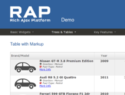
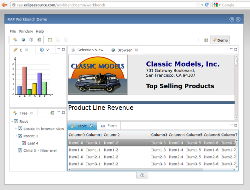

Building the RAP Example Applications
=====================================

The [`pom.xml`](./pom.xml) in this project helps build the `.war` files of the RAP demo projects. By default, the p2 repositories created from the nightly RAP and RAP Incubator builds are used (see below).

    mvn -e clean verify

At the moment it generates three `.war` files that can be deployed in any web container: `rapdemo.war`, `workbench.war`, `controls.war`.

The RAP Examples Demo (`rapdemo.war`) requires bundles from additional projects. These bundles need to be compiled externally and added to the `.war` file manually.

* Google Maps:
  https://github.com/eclipsesource/rap-gmap
* Complex Data:
  https://github.com/ralfstx/rap-demo-additions
* d3 Chart:
  https://github.com/ralfstx/rap-d3charts
* AutoSuggest:
  http://git.eclipse.org/c/rap/incubator/org.eclipse.rap.incubator.dropdown.git/

Online demos to see RAP applications in action
----------------------------------------------

|    |    |
|---:|----|
|  | **RAP Examples Demo** This application shows samples of the widgets available in RAP. Please note that it does not represent the complete widget set, but only a small selection.  [See the examples demo online](http://rap.eclipsesource.com/demo/release/rapdemo/) |
|  | **RAP Workbench Demo** This demo shows a simple application based on the Eclipse 3.x workbench that is built on top of RAP. Though it is not meant to be production ready it shows a good deal of the framework's possibilities, including views, menus, and the selection service. To demonstrate how this application looks with different themes and layouts, a [standard theme](http://rap.eclipsesource.com/demo/release/workbench/), [business theme](https://rap.eclipsesource.com/demo/release/workbench/business) and a [fancy theme](http://rap.eclipsesource.com/demo/release/workbench/fancy) are available.  [See the workbench demo online ](http://rap.eclipsesource.com/demo/release/workbench/) |
|  | **RAP Controls Demo** This application shows the various available controls that are available in RAP.  [See the controls demo online](http://rap.eclipsesource.com/demo/release/controls/) |
|    |    |

Changing the default p2 repositories
------------------------------------

The default build uses the nightly build from the RAP Runtime project and the nightly build of the RAP Incubator projects.
This default behavior can be changed by setting the properties `rap-repo.url` and `rap-incubator-repo.url`.

Example with RAP 3.0 and RAP Incubator builds for 3.0:

    mvn -e \
      -Drap-repo.url=http://download.eclipse.org/rt/rap/3.0/ \
      -Drap-incubator-repo.url=http://download.eclipse.org/rt/rap/incubator/3.0/ \
      clean verify
